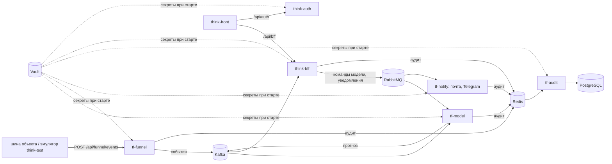

# think-bff

Backend for Frontend: единственный API, в который ходит интерфейс
[think-front](https://github.com/Think-Faster/think-front). Отвечает за права (RBAC: пользователи,
группы, ресурсы, битовая маска прав), область видимости объектов, заявки, решения диспетчера по
тревогам и настройки модели. Прогнозы читает из Kafka, команды модели и уведомления шлёт в RabbitMQ.
Токены проверяет по публичному ключу [think-auth](https://github.com/Think-Faster/think-auth).
Наружу порты не открыты: вход только через nginx (`/api/bff`).

Стек: .NET 8, ASP.NET Core Web API, EF Core 8 + PostgreSQL, FluentValidation, Serilog. Секреты —
из Vault при старте контейнера.

## Что где лежит

| Папка | Что внутри |
|---|---|
| [BFF](BFF) | решение .NET; [BFF/README.md](BFF/README.md) — сборка, переменные окружения, миграции, Vault |
| [BFF/src/BFF.WebApi](BFF/src/BFF.WebApi) | точка входа: контроллеры, middleware, авторизация |
| [BFF/src/BFF.Application](BFF/src/BFF.Application) | бизнес-логика: сервисы, валидаторы |
| [BFF/src/BFF.Contracts](BFF/src/BFF.Contracts) | DTO запросов и ответов API |
| [BFF/src/BFF.Models](BFF/src/BFF.Models) | доменные сущности, без зависимостей |
| [BFF/src/BFF.Context](BFF/src/BFF.Context) | EF Core: контекст, конфигурации, миграции, репозитории |
| [BFF/src/BFF.Infrastructure](BFF/src/BFF.Infrastructure) | клиент think-auth и проверка JWT |
| [BFF/docs](BFF/docs) | [API.md](BFF/docs/API.md) — ручки, [DECISIONS.md](BFF/docs/DECISIONS.md) — принятые решения, интеграция с фронтом, уведомления, ELMA365, переход на Vault |
| [BFF/deploy](BFF/deploy) | Dockerfile, docker-compose, контур миграций |
| [BFF/scripts](BFF/scripts) | начальные данные: SQL и загрузка с паролем из Vault |
| [.github/workflows](.github/workflows) | выкатка и миграции: пуш в `prod` выкатывает на [thinkfaster.ru](https://thinkfaster.ru) |

Зависимости проектов идут в одну сторону: `WebApi → Application, Contracts, Infrastructure`;
`Application → Context, Contracts, Models`; `Context → Models`. Контроллеры не обращаются к базе
напрямую — только через сервисы `Application`.

## Проект целиком

Think-Faster — сервис прогнозирования инцидентов в инженерных коллекторах (ЛЦТ-2026). Раз в час он
оценивает 78 объектов по журналу событий системы мониторинга и за сутки предупреждает о шести типах
происшествий: пожар, загазованность, подтопление, отказ оборудования, отказ датчика, проникновение.
К тревоге прилагаются основания и рекомендация: что сделать, в какой срок, кого послать. Решение
принимает диспетчер, сервис ничем на объекте не управляет.

| Что | Где |
|---|---|
| Прототип | [thinkfaster.ru](https://thinkfaster.ru) |
| Документация для экспертов: вход, архитектура, решения, методы, соответствие ТЗ, развёртывание, обзор | [think-infra/docs/project](https://github.com/Think-Faster/think-infra/tree/dev/docs/project) |
| Описание системы по сервисам | [think-infra/docs/system](https://github.com/Think-Faster/think-infra/tree/dev/docs/system) |
| Сопроводительная документация по ГОСТ 34.602, модель и исследование | [Think-Faster/docs/документация.md](https://github.com/Think-Faster/Think-Faster/blob/main/docs/документация.md) |

| Репозиторий | Что это | Стек |
|---|---|---|
| [Think-Faster](https://github.com/Think-Faster/Think-Faster) | модель прогноза, приём данных, уведомления, аудит; исследование, датасет, документация | Python, FastAPI, CatBoost, XGBoost, PyTorch; Go |
| [think-front](https://github.com/Think-Faster/think-front) | веб-интерфейс: диспетчер, главный диспетчер, инженер, администратор | React 19, TypeScript, Zustand |
| [think-bff](https://github.com/Think-Faster/think-bff) | API для интерфейса: права, группы, объекты, заявки, прогнозы, настройки модели | .NET 8, ASP.NET Core, EF Core, PostgreSQL |
| [think-auth](https://github.com/Think-Faster/think-auth) | вход и выпуск токенов RS256 | .NET 8, EF Core, PostgreSQL |
| [think-infra](https://github.com/Think-Faster/think-infra) | стенд: Vault, PostgreSQL, Kafka, RabbitMQ, Redis, nginx, почта, Telegram; выкатка | Docker Compose, Bash, GitHub Actions |
| [think-test](https://github.com/Think-Faster/think-test) | эмулятор шины объекта и проверка доступности стенда | Python, Django |

Код, который работает на [thinkfaster.ru](https://thinkfaster.ru): у think-front, think-bff и
think-auth — ветка `prod`; у think-infra — `prod`, документация — `dev`; у Think-Faster и think-test —
`main`.
